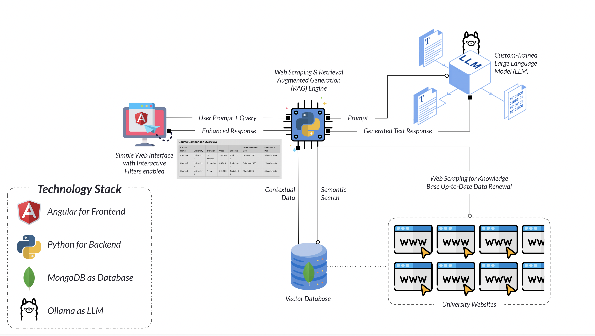

# UniWise 🎓

**UniWise** is an AI-powered smart guidance tool that helps students make informed decisions about higher education. Tailored for private universities in Sri Lanka, UniWise simplifies course selection by providing real-time, accurate, and personalized information — all in one place.

---

## 🚩 Problem Statement

Choosing the right higher education path can be challenging due to:

- Varying tuition costs, course structures, and durations across institutions.
- Manual research being time-consuming and often inaccurate.
- A lack of personalized, centralized guidance for students.

---

## ✅ The Solution

UniWise addresses these problems by:

- Aggregating data from multiple university websites through web scraping.
- Using an AI-powered engine to compare tuition fees, course durations, structures, and installment plans.
- Offering personalized recommendations based on user preferences, financial capacity, and career goals.
- Delivering structured and easy-to-understand information through an interactive, user-friendly interface.

---

## 🔍 Key Features

- 📡 **Real-Time Data**: Pulls up-to-date course details directly from official university sources.
- ✅ **Accurate & Reliable**: Offers precision-driven results to aid confident decision-making.
- 🧭 **Smart Recommendations**: AI-based suggestions personalized to the user's goals and preferences.
- 🧮 **Comparison Matrix**: Helps compare programs easily based on key attributes.
- 🎯 **Advanced Filtering**: Filter by cost, duration, course level (Certification, Diploma, HND, Bachelor's, Master's), and more.
- 🔔 **Notifications**: Alerts users about upcoming batch commencement dates.

---

## 🛠️ Technology Stack

- **Frontend**: Angular 19
- **Backend**: Python (FastAPI/Flask recommended)
- **Database**: MongoDB
- **AI/LLM Engine**: Ollama 3.2
- **Architecture**: Retrieval-Augmented Generation (RAG)

---

## ⚙️ System Architecture



### Pre-requisites
- Install **Python**: 3.10 or higher
- Install **Node.js**: 20 or higher
- Run **Ollama**: 3.2 or higher in you machine (https://ollama.com/download)

## 🚀 Installation

### Clone the repo:

```bash
git clone https://github.com/RockKanchana/univars.git
cd uniwise

npm install
pip install -r requirements.txt

npm run start
````
This runs both:
- ```ng serve``` (Angular FE)
- ```python3 app.py``` (Python BE)
